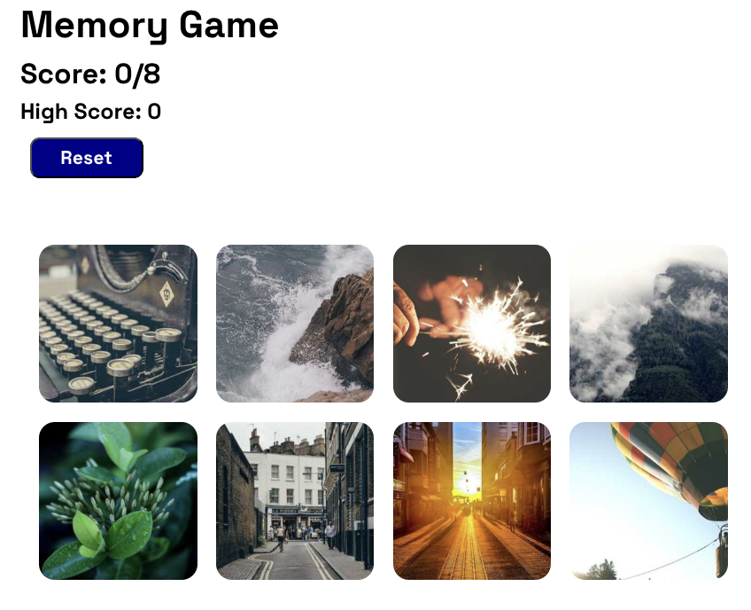

# Memory Card Game

This is a fun and interactive memory card game built with React! The goal of the game is to click on unique cards without clicking the same one twice.

## Features

- **Scoreboard**: Tracks your current score and displays your highest score (Best Score).
- **Randomized Cards**: The cards shuffle into a random order whenever a user clicks one or when the game starts.
- **API Integration**: Fetches card images and data from an external API.
- **Responsive Design**: The game is styled for a seamless experience on desktop and mobile devices.

## How to Play

1. Click on a card to earn a point.
2. Don't click the same card more than once, or the game will reset!
3. Aim to beat your Best Score.

## Technologies Used

- React
- Hooks (e.g., `useState`, `useEffect`)
- CSS for styling
- Picsum API for images

## Getting Started

Live Game: https://carisaelam-memory-card-game.netlify.app

